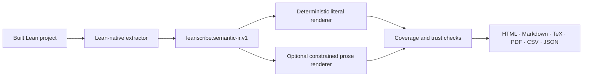

# LeanScribe

LeanScribe is an open-source semantic publishing layer for Lean 4: elaborated formal declarations in, readable and traceable mathematical literature out.

> Every generated sentence should be readable by a mathematician and traceable to the exact formal assumptions, objects, and conclusion from which it came.

The public beta is available at [leanscribe.agbanwajamal03.chatgpt.site](https://leanscribe.agbanwajamal03.chatgpt.site/).

## What is implemented now

> **Repository status:** The trusted semantic publishing release is deployed and implemented in [draft PR #2](https://github.com/JAgbanwa/LeanScribe/pull/2) at commit [`2422d0d`](https://github.com/JAgbanwa/LeanScribe/commit/2422d0d3154f3ddb4a5104ebd973964242042241). This README records that progress while the implementation awaits merge into `main`.

## What is implemented now

This release is the first slice of the **Trusted statement renderer** milestone.

- A Lean-native extractor loads an already-built module from its real project environment.
- The semantic IR records elaborated binders, binder visibility, full types, conclusions, type dependencies, source ranges, documentation, Lean version and commit, transitive axioms, `sorryAx`, and `Lean.trustCompiler` use.
- Literal rendering maps every binder, hypothesis, instance assumption, and conclusion to a coverage-ledger row.
- The web UI visibly separates `unelaborated` pasted-source drafts from `elaborated` semantic publications.
- Literal, polished, and explanatory views have different trust levels. Only complete elaborated coverage is eligible for the structural-check badge.
- HTML, Markdown, LaTeX, PDF, CSV, and JSON exports are generated from one publication model. TeX, PDF, and CSV carry trust provenance alongside the statement.
- Optional model-based polishing accepts semantic IR only. Raw `.lean` source is never sent to the model.
- Mutation tests verify that changing a domain or conclusion changes the literal publication.

LeanScribe uses this exact wording for its strongest current claim:

> Generated from a kernel-accepted formal statement; prose correspondence has passed LeanScribe’s structural checks.

It does **not** call generated English “formally verified.” Structural correspondence is narrower than mathematical review.

## Product boundary

| Capability | Current status | Trust boundary |
| --- | --- | --- |
| Statement rendering | Milestone 1 implementation | Elaborated IR plus complete coverage ledger can receive structural trust |
| Proof explanation | Not implemented as a trusted capability | Tactic scripts are not assumed to be the best mathematical explanation |
| Exposition generation | Clearly labeled lower-trust commentary | Motivation and intuition are interpretive and require review |
| Document publishing | HTML, Markdown, TeX, PDF, CSV, JSON | All formats derive from the same publication record |

The initial user is a mathematician who opens a Lean project, selects a result, and wants a faithful statement suitable for a paper after minimal editing.

## Two input paths

### Trusted path: elaborated semantic IR

The extractor works from Lean’s environment after elaboration. It does not use regular expressions to determine the trusted meaning of a declaration and it does not ask an LLM to recover hidden semantics from raw source.

Requirements: Lean `4.21.0` (the pinned toolchain), Lake, Node.js `>=22.13.0`, and npm.

Build LeanScribe’s extractor:

```bash
git clone https://github.com/JAgbanwa/LeanScribe.git
cd LeanScribe
git switch codex/semantic-reverse-translation # until PR #2 is merged
lake build leanscribe_extract
```

Build the target project first, then run the extractor through the target project’s environment so its imports and package paths are available:

```bash
cd /path/to/target-project
lake build
lake env /path/to/LeanScribe/.lake/build/bin/leanscribe_extract \
  MyProject.MyModule MyModule.leanscribe.json
```

Open the resulting `.leanscribe.json` in the LeanScribe website. The UI displays source ranges, semantic coverage, Lean/toolchain provenance, proof status, axioms, `sorryAx`, and native-evaluation trust-base use.

### Convenience path: pasted source draft

Pasting or opening a `.lean` file in the browser creates a fast, local, **unelaborated source preview**. It is useful for drafting and export experiments, but it cannot earn a semantic trust badge. The interface labels its ledger entries `provisional` and says that no semantic trust claim is made.

This distinction is deliberate: Lean syntax is extensible, while elaboration resolves implicit arguments, coercions, type-class instances, macros, and notation.

## Trust model

LeanScribe exposes three prose levels:

- **Literal:** deterministic and maximally explicit; the coverage ledger maps each semantic component to a prose span.
- **Polished:** paper-style prose derived from the semantic IR or an author-supplied documentation string; still reviewable against the ledger.
- **Explanatory:** generated interpretation, intuition, or proof commentary; visibly lower trust.

The current semantic IR schema is `leanscribe.semantic-ir.v1`. Each declaration includes:

- stable semantic ID, name, namespace, kernel kind, and editorial-classification provenance;
- explicit, implicit, strict-implicit, and instance binders in elaborated order;
- elaborated type, conclusion, type dependencies, documentation, and source range;
- transitive axioms, `sorryAx`, native-evaluation marker, and proof status;
- Lean version, Lean commit, extraction time, and optional repository/source provenance.

The kernel does not preserve the author’s editorial distinction between `theorem` and `lemma`. The extractor therefore records the kernel kind and says when no editorial override was supplied; it does not invent “corollary.” Source-aware classification and `.leanscribe.toml` terminology overrides remain roadmap items.

## Local web development

```bash
npm install
npm run dev
```

Useful commands:

```bash
npm run build      # production web build
npm test           # web, conversion, coverage-ledger, and mutation tests
npm run lint       # ESLint
npm run test:lean  # build the native extractor and fixture
```

The public deployment is local-only and has no OpenAI API key. If a controlled self-hosted deployment enables optional polishing, it must set both `EXPERT_MODE_ENABLED=true` and `OPENAI_API_KEY`. The API rejects raw Lean source and accepts only a validated elaborated semantic bundle; requests use `store: false`.

## Architecture



Lean’s processing pipeline and `InfoTree` APIs are the intended foundation for richer source-to-semantic correspondence. See the [Lean elaboration reference](https://lean-lang.org/doc/reference/latest/Elaboration-and-Compilation/) and [InfoTree API](https://lean-lang.org/doc/api/Lean/Elab/InfoTree/Types.html). The current extractor starts from the compiled environment and declaration ranges; expression-level InfoTree spans are next.

LeanScribe should complement whole-library documentation tools such as [doc-gen4](https://github.com/leanprover/doc-gen4), not recreate their project build and browsing infrastructure.

## Security boundary

Elaborating an uploaded Lean project is running untrusted code: Lean elaborators can perform IO. The public beta therefore does **not** accept server-side project uploads or GitHub repositories and does not claim sandboxed remote elaboration.

Before those features ship, each job must run as an ephemeral nonprivileged workload with no network or host secrets, read-only inputs, controlled caches, strict resource/process limits, archive/path protections, audited Lean and TeX toolchains, TeX shell escape disabled, sanitized output, rate limits, and retention controls. See [docs/THREAT_MODEL.md](docs/THREAT_MODEL.md).

```

The public deployment is local-only and has no OpenAI API key. If a controlled self-hosted deployment enables optional polishing, it must set both `EXPERT_MODE_ENABLED=true` and `OPENAI_API_KEY`. The API rejects raw Lean source and accepts only a validated elaborated semantic bundle; requests use `store: false`.

## Architecture


Lean’s processing pipeline and `InfoTree` APIs are the intended foundation for richer source-to-semantic correspondence. See the [Lean elaboration reference](https://lean-lang.org/doc/reference/latest/Elaboration-and-Compilation/) and [InfoTree API](https://lean-lang.org/doc/api/Lean/Elab/InfoTree/Types.html). The current extractor starts from the compiled environment and declaration ranges; expression-level InfoTree spans are next.

LeanScribe should complement whole-library documentation tools such as [doc-gen4](https://github.com/leanprover/doc-gen4), not recreate their project build and browsing infrastructure.

## Security boundary

Elaborating an uploaded Lean project is running untrusted code: Lean elaborators can perform IO. The public beta therefore does **not** accept server-side project uploads or GitHub repositories and does not claim sandboxed remote elaboration.

Before those features ship, each job must run as an ephemeral nonprivileged workload with no network or host secrets, read-only inputs, controlled caches, strict resource/process limits, archive/path protections, audited Lean and TeX toolchains, TeX shell escape disabled, sanitized output, rate limits, and retention controls. See [docs/THREAT_MODEL.md](https://github.com/JAgbanwa/LeanScribe/blob/codex/semantic-reverse-translation/docs/THREAT_MODEL.md).

For formal trust, LeanScribe reports transitive axioms and incomplete proofs rather than hiding them. The relevant Lean references are [Axioms](https://lean-lang.org/doc/reference/latest/Axioms/) and [Validating Lean Proofs](https://lean-lang.org/doc/reference/latest/ValidatingProofs/).

## Roadmap and evaluation

The detailed, acceptance-test-driven roadmap is in [docs/ROADMAP.md](docs/ROADMAP.md). The evaluation protocol is in [docs/EVALUATION.md](docs/EVALUATION.md).
The detailed, acceptance-test-driven roadmap is in [docs/ROADMAP.md](https://github.com/JAgbanwa/LeanScribe/blob/codex/semantic-reverse-translation/docs/ROADMAP.md). The evaluation protocol is in [docs/EVALUATION.md](https://github.com/JAgbanwa/LeanScribe/blob/codex/semantic-reverse-translation/docs/EVALUATION.md).

The next milestone is not general proof narration. It is making statement fidelity exceptional: richer InfoTree alignment, source hashes and repository commits, author-preserved editorial kinds, configuration/terminology locks, project outline and batch conversion, accessible MathML, and a 200–500 declaration expert-reviewed Lean 4/mathlib benchmark.

## Project structure

```text
LeanScribe/Extractor.lean         Lean-native semantic extractor CLI
LeanScribe/ExtractorFixture.lean  Axiom/sorry/source-range fixture
lib/semantic-ir.ts               IR validation, literal prose, coverage, publishing
lib/lean-converter.ts            Draft preview plus TeX/CSV/PDF generation
app/components/LeanScribe.tsx     Synchronized source, prose, ledger, and exports
app/api/translate/route.ts        Optional IR-only constrained prose endpoint
docs/                             Architecture, threat model, roadmap, evaluation
tests/                            Rendering, classification, ledger, mutation tests
```

## License

MIT
